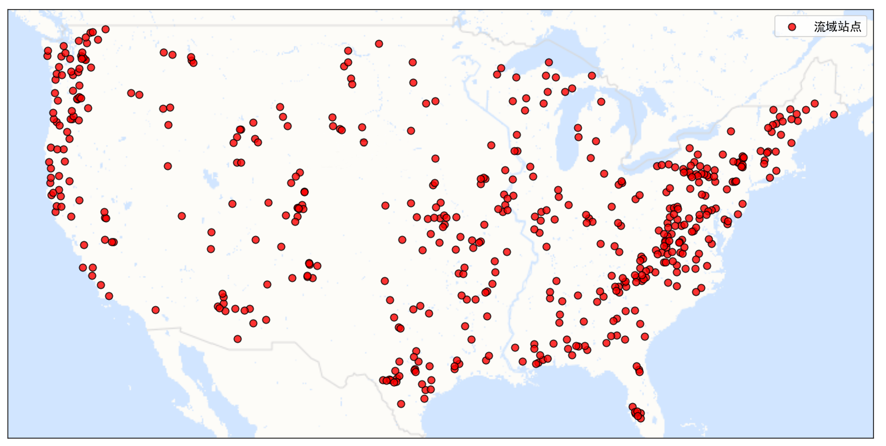

# flood-forecasting-models

我的本科毕业设计，一个使用多流域数据训练、可以应用到不同流域的区域洪水预测模型。这个仓库包括了我的模型、对比模型、消融模型、训练、测试和绘图的代码。

## 1. 使用示例

注：需要配置`CAMELS US`数据集，配置方法详见`3.数据准备`。

~~~shell
cd trainer-chunked

# 模型训练和验证
python train.py --batch_size=256 --train_start_time=2002-10-01T00 --train_end_time=2007-09-30T00 --epoch=50 --save_freq=1 --use_GPU --GPU_id=0 --val_freq=1 --val_start_time=2007-10-01T00 --val_end_time=2009-09-30T00 --num_workers=8 --train_basin_list=30_basin_list_evenly.txt --val_basin_list=30_basin_list_evenly.txt --train_dataset_path=../data/CAMELS_US/hourly/30_basin_list_evenly_train_5y.nc --val_dataset_path=../data/CAMELS_US/hourly/30_basin_list_evenly_val_2y.nc --dynamic_meanstd=dynamic_30_basin_list_evenly.csv --static_meanstd=static_30_basin_list_evenly.csv

# 测试
python -u test.py --use_GPU --GPU_id 0 --num_workers=4 --start_time=2009-10-01T00 --end_time=2011-09-30T00 --model_path=./checkpoints/epoch3.pth --basin_list=30_basin_list_evenly.txt --test_basin_by_basin --dynamic_meanstd=dynamic_30_basin_list_evenly.csv --static_meanstd=static_30_basin_list_evenly.csv
~~~

## 2. 代码结构说明

~~~shell
flood-forecasting-models
├─data	# 存储数据
│  ├─basin_list		# 存储训练和测试的流域列表
│  └─CAMELS_US		# CAMELS US数据集, 详见下文
│     ├─basin_mean_forcing		# 日尺度的气象数据
│     ├─usgs_streamflow			# 日尺度的流量数据
│     ├─camels_attributes_v2.0	# 流域属性/集水区属性/静态数据
│     └─hourly		# 516个流域的小时尺度气象和流量数据
│        └─usgs-streamflow-nldas_hourly.nc
├─lstm-daily		# Handoff LSTM(日尺度数据)
├─lstm-hourly		# Handoff LSTM(小时尺度数据)
├─transformer-lstm-original		# 原始的LSTM-Transformer
├─trainer-full		# 训练我的模型的框架，训练和验证的数据只能来自同一个`.nc`文件
├─trainer-chunked	# 训练我的模型的框架，训练和验证的数据可以来自不同的`.nc`文件
├─modelzoo			# 存储所有的模型
│  ├─comparison		# 对比模型
│  └─ablation		# 消融模型
└─utils		# 数据集划分、聚类和绘图的代码
~~~

* 关于`trainer_full`和`trainer_chunked`的说明

  这两个文件夹均包含了数据处理、模型训练和测试的完整代码，想要使用它们训练模型，可以将`modelzoo`里的模型重命名为`model.py`后替换原有的`model.py`文件。`modelzoo/comparison`里的模型与其他模型在使用的数据上有所不同，故将它们实现在了`lstm-xxx`和`transformer-lstm-original`。

  `trainer_full`和`trainer_chunked`的区别在于：使用前者训练时，训练和验证阶段的数据只能来自同一个数据文件（`.nc`）。换句话说，无法通过命令行传递`train_dataset_path`和`val_dataset_path`参数，训练的代码默认从`settings.py`的`dataset_path`参数中读取数据文件(`.nc`)，用于训练和测试；而后者则可以通过`train_dataset_path`和`val_dataset_path`参数为训练和测试阶段指定不同的数据文件。

  起初，仅有`trainer_full`这一个文件夹，程序一次性读取包含所有数据的文件，用于训练和测试。但由于一次性读入一个大文件，内存占用过大，在多线程的情况下，程序容易崩溃。而且，在CPU性能较弱的电脑上，程序也很容易卡死在数据处理和创建多个数据加载线程的阶段。考虑到上述原因，对`trainer_full`进行了修改得到`trainer_chunked`，让它可以灵活地从小文件中分别读取训练和测试的数据。


## 3. 数据准备

按照下面的教程下载`CAMELS US`数据集，并按照教程中的方法组织文件结构，将下载好的文件放到`./data/CAMELS_US`。

需要下载的数据包括：

* 日尺度的气象数据和流量数据
* 小时尺度的气象数据和流量数据
* 流域属性

如果不需要运行`lstm-daily`，那么只需要下载小时尺度的气象数据、流量数据和流域属性，即仅需下载`CAMELS_US/camels_attributes_v2.0`和`CAMELS_US/hourly/usgs-streamflow-nldas_hourly.nc`

> CAMELS US数据集的配置方法
>
> 转载自：[Data Prerequisites — NeuralHydrology 1.11.0 documentation](https://neuralhydrology.readthedocs.io/en/stable/tutorials/data-prerequisites.html) 
>
> `# Data Prerequisites` 
>
> All of our tutorials in which you train and evaluate a model use the [CAMELS US](https://ral.ucar.edu/solutions/products/camels) data set, either in its original form or with some extensions. In this notebook, we will guide you through the process of downloading all essential data set pieces and explain how NeuralHydrology expects the folder structure of the CAMELS US dataset so that you will be able to run all of the tutorials.
>
> 
>
> `## CAMELS US meteorological time series and streamflow data`
>
> The meteorological time series serve in most of our tutorials as model inputs, while the streamflow time series are the target values. You can download both from the [NCAR Homepage](https://gdex.ucar.edu/dataset/camels.html). Click on “Individual Files” under “Download Data and Documentation” and download the file “basin_timeseries_v1p2_metForcing_obsFlow.zip”, or use [this](https://gdex.ucar.edu/dataset/camels/file/basin_timeseries_v1p2_metForcing_obsFlow.zip) direct link. The downloaded zip file, called `basin_timeseries_v1p2_metForcing_obsFlow.zip` contains two folders: `basin_dataset_public` (empty, 0 bytes) and `basin_dataset_public_v1p2` (not empty, 14.9 GB). Extract the second one (basin_dataset_public_v1p2) to any place you like and probably rename it something more meaningful, like `CAMELS_US`. This folder is referred to as the root directory of the CAMELS US dataset. Among others, it should contain the following subdirectories:
>
> ```
> CAMELS_US/              # originally named basin_dataset_public_v1p2
> - basin_mean_forcing/   # contains the meteorological time series data
> - usgs_streamflow/      # contains the streamflow data
> - ...
> ```
>
> **NOTE**: In the default configs of our tutorials, we assume that the data is stored in `neuralhydrology/data/CAMELS_US`. If you stored the data elsewhere, either create a symbolic link to this location or change the `data_dir` argument in the `.yml` configs of the corresponding tutorials to point to your local CAMELS US root directory.
>
> 
>
> `## Hourly forcing and streamflow data for CAMELS US basins`
>
> (required for Tutorial 04 - Multi-Timescale Prediction)
>
> To be able to run this example yourself, you will need to download the [hourly NLDAS forcings and the hourly streamflow data](https://doi.org/10.5281/zenodo.4072700). Within the CAMELS US root directory, place the `nldas_hourly` and `usgs-streamflow` folders into a directory called `hourly` (`/path/to/CAMELS_US/hourly/{nldas_hourly,usgs-streamflow}`). Alternatively, you can place the hourly netCDF file (`usgs-streamflow-nldas_hourly.nc`) from [Zenodo](https://zenodo.org/badge/DOI/10.5281/zenodo.4072700) inside the `hourly/` folder instead of the NLDAS and streamflow csv files. Loading from netCDF will be faster than from the csv files. In case of the first option (downloading the two folders), the CAMELS US folder structure from above would extend to:
>
> ```
> CAMELS_US/              # originally named basin_dataset_public_v1p2
> - basin_mean_forcing/   # contains the meteorological time series data
> - usgs_streamflow/      # contains the streamflow data
> - hourly/               # newly created folder to store the hourly forcing and streamflow data
>     - nldas_hourly/     # NLDAS hourly forcing data
>     - usgs-streamflow/  # hourly streamflow data
> - ...
> ```
>
> In case you downloaded the `usgs-streamflow-nldas_hourly.nc` it should like this:
>
> ```
> CAMELS_US/                              # originally named basin_dataset_public_v1p2
> - basin_mean_forcings/                  # contains the meteorological time series data
> - usgs_streamflow/                      # contains the streamflow data
> - hourly/                               # newly created folder to store the hourly forcing and streamflow data
>     - usgs-streamflow-nldas_hourly.nc   # netCDF file containing hourly forcing and streamflow data
> - ...
> ```
>
> 
>
> `## CAMELS US catchment attributes`
>
> (required for Tutorial 06 - How-to Finetuning)
>
> When training a deep learning model, such as an LSTM, on data from more than one basin it is recommended to also use static catchment attributes as model inputs, alongside the meteorological forcings (see e.g. [this paper](https://hess.copernicus.org/articles/23/5089/2019/)). In tutorial 06, we use the static catchment attributes that are part of the CAMELS US dataset. They are stored in 7 txt files (camels_clim.txt, camels_geol.txt, camels_hydro.txt, camels_name.txt, camels_soil.txt, camels_topo.txt, and camels_vege.txt) that can be downloaded from [this page](https://gdex.ucar.edu/dataset/camels/file.html). The attribute files should be saved in a folder called `camels_attributes_v2.0`. Place this folder into the CAMELS US root directory (at the same level of `basin_mean_forcing` and `usgs_streamflow`). So your folder structure should at least look like this:
>
> ```
> CAMELS_US/                  # originally named basin_dataset_public_v1p2
> - basin_mean_forcing/       # contains the meteorological time series data
> - usgs_streamflow/          # contains the streamflow data
> - camels_attributes_v2.0/   # extracted catchment attributes
> - ...
> ```

  

## 5. 对比模型

Handoff-LSTM 

- Nearing,Grey,et al."Global prediction of extreme floods in ungauged watersheds".Nature,vol.627,2024,pp.559-563,https://doi.org/10.1038/s41586-024-07145-1. 

Transformer LSTM model

- Li,Wenzhong,et al."An interpretable hybrid deep learning model for flood forecasting based on Transformer and LSTM".Journal of Hydrology: Regional Studies,vol.54,2024,pp.101873,https://doi.org/10.1016/j.ejrh.2024.101873. 

## Acknowledgments
This project incorporates code from:
- NeuralHydrology (https://github.com/neuralhydrology/neuralhydrology), licensed under the BSD 3-Clause License.